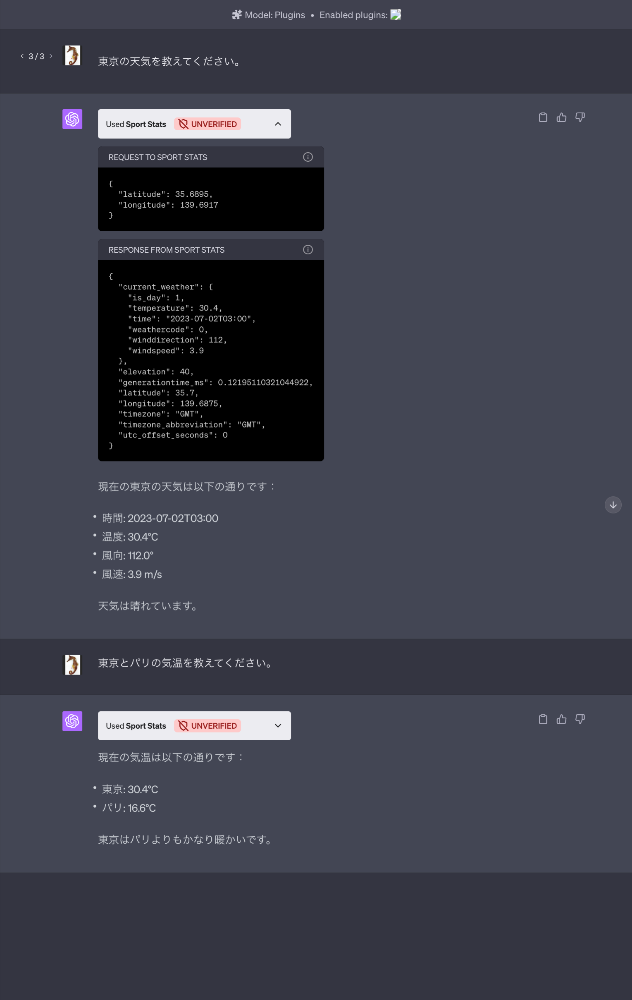

# ChatGPT plugins quickstart

Get a todo list ChatGPT plugin up and running in under 5 minutes using Python. This plugin is designed to work in conjunction with the [ChatGPT plugins documentation](https://platform.openai.com/docs/plugins). If you do not already have plugin developer access, please [join the waitlist](https://openai.com/waitlist/plugins).

## Setup locally

To install the required packages for this plugin, run the following command:

```bash
pip install -r requirements.txt
```

To run the plugin, enter the following command:

```bash
python main.py
```

Once the local server is running:

1. Navigate to https://chat.openai.com. 
2. In the Model drop down, select "Plugins" (note, if you don't see it there, you don't have access yet).
3. Select "Plugin store"
4. Select "Develop your own plugin"
5. Enter in `localhost:5003` since this is the URL the server is running on locally, then select "Find manifest file".

The plugin should now be installed and enabled! You can start with a question like "What is on my todo list" and then try adding something to it as well! 

## Setup remotely

### Cloudflare workers

### Code Sandbox

### Replit

## Getting help

If you run into issues or have questions building a plugin, please join our [Developer community forum](https://community.openai.com/c/chat-plugins/20).

## スクリーンショット



REST API としては, 1 雲の [緯度。軽度] を指定したら、そこの天気情報を返すだけのものを定義しただけ。
ChatGPT が都市の名前から [緯度, 軽度] に変換をしてくれる。
複数の都市を指定したr、それぞれについて調べてくれる。

## See

See
- https://ascii.jp/elem/000/004/140/4140826/
  ChatGPTでプログラミングのフラット化がはじまっている

- https://www.gis-py.com/entry/weather-json
  Python と気象庁の天気予報 JSON を使って全国の天気予報を取得してみる
